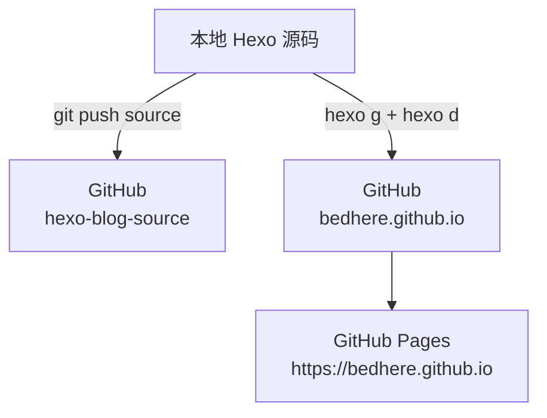
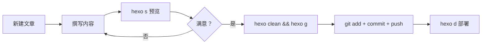

## 一、部署架构

本博客采用 **双仓库分离架构**：



- **源码仓库**：`hexo-blog-source` - 备份文章、主题、配置
- **Pages 仓库**：`bedhere.github.io` - 存放静态页面，自动部署上线

---

## 二、Git 部署方式

### 2.1 HTTPS 方式（初始推荐）

**优点**：配置简单，无需生成密钥  
**缺点**：每次推送需输入账号密码

```bash
# 添加远程仓库
git remote add source https://github.com/bedhere/hexo-blog-source.git
git remote add pages https://github.com/bedhere/bedhere.github.io.git

# 查看远程仓库
git remote -v
```

---

### 2.2 SSH 方式（长期推荐）

**优点**：一次配置永久使用，无需重复输入密码  
**缺点**：首次需生成 SSH Key

#### （1）生成 SSH Key

```bash
# 生成 RSA 密钥（邮箱改为你的 GitHub 注册邮箱）
ssh-keygen -t rsa -C "your@email.com"
```

> 💡 提示：一路回车即可，默认保存在 `~/.ssh/id_rsa.pub`

#### （2）复制公钥

```bash
# Windows PowerShell
cat ~/.ssh/id_rsa.pub

# 或使用记事本打开
notepad ~/.ssh/id_rsa.pub
```

复制全部内容（以 `ssh-rsa` 开头）

#### （3）添加到 GitHub

1. 登录 GitHub → 右上角头像 → **Settings**
2. 左侧菜单 **SSH and GPG keys** → **New SSH key**
3. 粘贴公钥内容 → **Add SSH key**

#### （4）切换为 SSH 地址

```bash
# 将 HTTPS 改为 SSH 格式
git remote set-url source git@github.com:bedhere/hexo-blog-source.git
git remote set-url pages git@github.com:bedhere/bedhere.github.io.git

# 验证连接
ssh -T git@github.com
```

看到 `Hi bedhere! You've successfully authenticated` 即成功。

---

## 三、Hexo 博客部署实战

### 3.1 初始化 Git 仓库

```bash
# 进入 Hexo 根目录
cd E:\BlogFile

# 初始化 Git
git init

# 添加远程仓库（二选一：HTTPS 或 SSH）
git remote add source https://github.com/bedhere/hexo-blog-source.git
git remote add pages https://github.com/bedhere/bedhere.github.io.git
```

### 3.2 配置 .gitignore

创建 `.gitignore` 文件，排除无关文件：

```gitignore
node_modules/
public/
db.json
*.log
.DS_Store
Thumbs.db
.vscode/
.idea/
.deploy*/
themes/butterfly/.git
```

### 3.3 提交源码到远程仓库

```bash
# 添加所有文件
git add .

# 提交更改
git commit -m "init: hexo source backup"

# 推送到源码仓库
git push -u source main
```

### 3.4 部署静态页面到 Pages

```bash
# 清理缓存 + 生成静态文件 + 部署
hexo clean && hexo g && hexo d
```

**部署原理**：
- `hexo g`：生成 `public/` 目录
- `hexo d`：将 `public/` 推送到 `_config.yml` 中配置的 `repo` 地址

```yaml
# _config.yml 中的部署配置
deploy:
  type: git
  repo: https://github.com/bedhere/bedhere.github.io.git
  branch: main
```

---

## 四、Git 常用指令速查

### 4.1 基础操作

| 指令 | 作用 | 示例 |
|------|------|------|
| `git init` | 初始化 Git 仓库 | `git init` |
| `git clone <url>` | 克隆远程仓库 | `git clone https://github.com/user/repo.git` |
| `git status` | 查看文件状态 | `git status` |
| `git add <file>` | 添加文件到暂存区 | `git add .` |
| `git commit -m "msg"` | 提交到本地仓库 | `git commit -m "fix bug"` |
| `git push <remote> <branch>` | 推送到远程 | `git push source main` |
| `git pull <remote> <branch>` | 拉取远程更新 | `git pull source main` |

### 4.2 分支管理

| 指令 | 作用 | 示例 |
|------|------|------|
| `git branch` | 查看分支 | `git branch` |
| `git branch <name>` | 创建分支 | `git branch dev` |
| `git checkout <name>` | 切换分支 | `git checkout dev` |
| `git checkout -b <name>` | 创建并切换 | `git checkout -b feature` |
| `git merge <name>` | 合并分支 | `git merge dev` |

### 4.3 远程仓库

| 指令 | 作用 | 示例 |
|------|------|------|
| `git remote -v` | 查看远程仓库 | `git remote -v` |
| `git remote add <name> <url>` | 添加远程仓库 | `git remote add origin https://...` |
| `git remote remove <name>` | 删除远程仓库 | `git remote remove origin` |
| `git remote set-url <name> <url>` | 修改远程地址 | `git remote set-url origin git@...` |

### 4.4 撤销与回退

| 指令 | 作用 | 示例 |
|------|------|------|
| `git reset --soft HEAD^` | 撤销上一次 commit（保留更改） | `git reset --soft HEAD^` |
| `git reset --hard HEAD^` | 彻底撤销上一次 commit | `git reset --hard HEAD^` |
| `git checkout -- <file>` | 丢弃工作区修改 | `git checkout -- config.yml` |
| `git revert <commit-id>` | 生成反向提交撤销指定 commit | `git revert abc123` |

### 4.5 日志查看

| 指令 | 作用 | 示例 |
|------|------|------|
| `git log` | 查看提交历史 | `git log` |
| `git log --oneline` | 简洁显示 | `git log --oneline` |
| `git log --graph` | 图形化显示分支 | `git log --graph` |

---

## 五、Hexo 博客日常工作流



### 标准流程

```bash
# 1. 新建文章
hexo new post "文章标题"

# 2. 在 source/_posts/ 中编辑 Markdown 文件

# 3. 本地预览
hexo s

# 4. 生成并部署
hexo clean && hexo g && hexo d

# 5. 备份源码
git add .
git commit -m "feat: 新增文章《文章标题》"
git push source main
```

---

## 六、常见问题

### 6.1 推送失败：Permission denied

**错误信息**：
```
fatal: Could not read from remote repository.
Please make sure you have the correct access rights
```

**解决方案**：改用 SSH 方式（见 2.2 节）

---

### 6.2 部署后页面未更新

**排查步骤**：
1. 确认 `hexo g` 成功生成 `public/`
2. 确认 `hexo d` 推送到正确的仓库
3. 清除浏览器缓存（`Ctrl + Shift + Delete`）
4. 检查 GitHub Pages 设置：**Settings → Pages → Source** 是否为 `main` 分支

---

### 6.3 误将 public/提交到源码仓库

```bash
# 从历史中彻底删除 public 目录
git filter-branch --force --index-filter \
  "git rm -rf --cached --ignore-unmatch public" \
  --prune-empty --tag-name-filter cat -- --all

# 强制推送
git push source --force --all
```

---

### 6.4 多人协作冲突

```bash
# 先拉取远程最新代码
git pull source main

# 解决冲突文件中的 <<<<<< 和 ====== 标记

# 重新提交
git add .
git commit -m "merge: 解决冲突"
git push source main
```

---

## 七、总结

**核心要点**：
- ✅ **双仓库分离**：源码与部署产物分开管理
- ✅ **SSH 优先**：一次配置永久使用，避免反复输入密码
- ✅ **定期备份**：每次写文章后记得 `git push source main`
- ✅ **部署顺序**：先 `hexo g` 生成，再 `hexo d` 部署

**最佳实践**：
```bash
# 日常写作模板
hexo new post "标题"      # 新建
hexo s                    # 预览
hexo clean && hexo g      # 生成
hexo d                    # 部署
git add . && git commit -m "msg" && git push source main  # 备份
```
