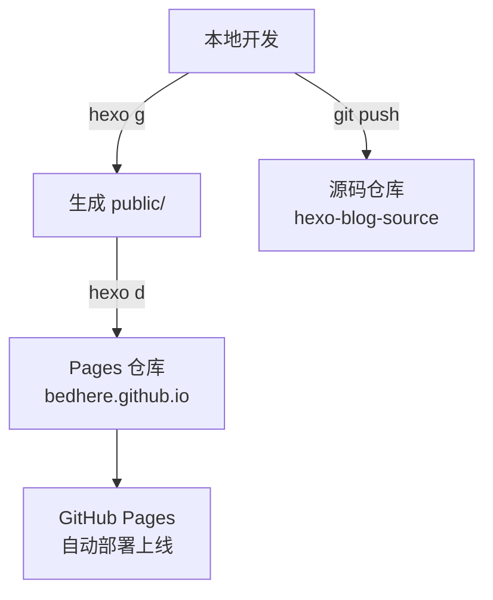
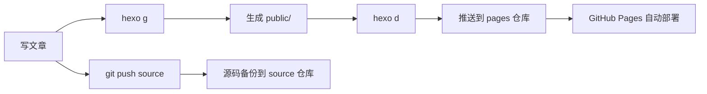

## 一、核心思想

**双仓库分离架构**：将 Hexo 源码与生成的静态页面分开管理，实现源码可追溯、部署自动化的目标。



---

## 二、准备工作

### 2.1 环境要求

- ✅ Node.js
- ✅ Hexo
- ✅ Git

### 2.2 创建仓库

在 GitHub 创建**两个空仓库**（不勾选 README）：

| 仓库名 | 用途 | 分支 |
|--------|------|------|
| `bedhere.github.io` | 存放静态页面（public 目录） | `main` |
| `hexo-blog-source` | 存放 Hexo 源码（文章/主题/配置） | `main` |

---

## 三、部署流程

### 3.1 初始化 Git 仓库

```bash
# 进入 Hexo 根目录
git init

# 添加两个远程仓库
git remote add pages https://github.com/bedhere/bedhere.github.io.git
git remote add source https://github.com/bedhere/hexo-blog-source.git
```

### 3.2 配置 .gitignore

```gitignore
node_modules/
public/
db.json
*.log
.DS_Store
Thumbs.db
.vscode/
.idea/
.deploy*/
themes/butterfly/.git
```

> ⚠️ **关键点**：排除 `public/` 和 `node_modules/`，只提交源码

### 3.3 提交源码

```bash
git add .
git commit -m "init: hexo source backup"
git push -u source main
```

### 3.4 部署到 GitHub Pages

```bash
hexo clean && hexo g && hexo d
```

**命令解析**：
- `hexo clean`：清理缓存
- `hexo g`：生成静态文件到 `public/`
- `hexo d`：将 `public/` 推送到 `pages` 远程仓库

---

## 四、工作流程图



---

## 五、常用命令速查

| 命令 | 作用 |
|------|------|
| `hexo new post "标题"` | 新建文章 |
| `hexo clean && hexo g` | 清理并生成静态文件 |
| `hexo d` | 部署到 GitHub Pages |
| `hexo s` | 本地预览（http://localhost:4000） |
| `git push source main` | 备份源码到远程 |

---

## 六、常见问题

### 6.1 Git 推送失败（HTTPS 443 错误）

**原因**：网络不稳定或代理冲突

**解决方案**：改用 SSH 连接

```bash
# 切换为 SSH 地址
git remote set-url pages git@github.com:bedhere/bedhere.github.io.git
git remote set-url source git@github.com:bedhere/hexo-blog-source.git

# 生成 SSH Key（如无）
ssh-keygen -t rsa -C "your@email.com"

# 将公钥添加到 GitHub Settings → SSH and GPG keys
cat ~/.ssh/id_rsa.pub
```

### 6.2 部署后页面未更新

1. 检查 `public/` 是否已正确生成
2. 确认 `hexo d` 成功推送到 `pages` 仓库
3. 清除浏览器缓存或使用 `Ctrl + F5` 强制刷新

### 6.3 误将 public/提交到源码仓库

```bash
# 从历史提交中彻底删除 public 目录
git filter-branch --force --index-filter \
  "git rm -rf --cached --ignore-unmatch public" \
  --prune-empty --tag-name-filter cat -- --all
  
# 强制推送到远程
git push source --force --all
```

---

## 七、总结

**双仓库架构优势**：
- ✅ 源码与部署产物分离，职责清晰
- ✅ 源码可追溯，支持版本回滚
- ✅ GitHub Pages 自动部署，无需手动干预
- ✅ 降低误操作风险（不会污染源码仓库）


